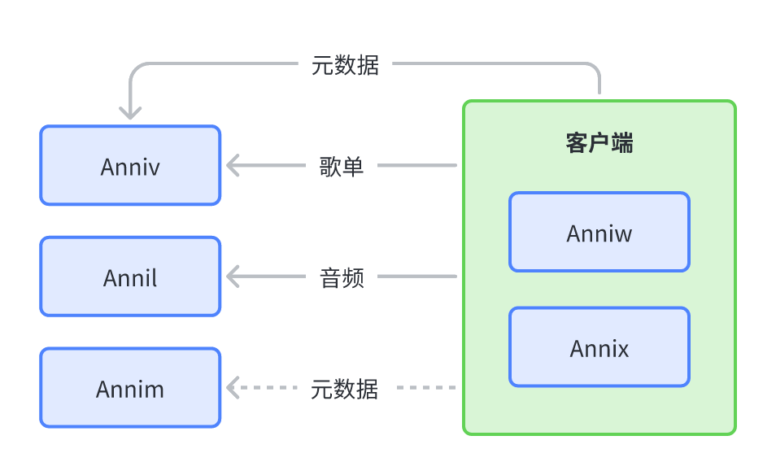

# 从零开始的 Anni 入门指南

`Project Anni` 是为 `Self host` 个人/小范围共享音乐平台而设计的一套服务。在正式开始使用或搭建之前，让我们首先来了解一下几个关键组成部分。

## 组成部分

一个完整的自建 Anni 服务的结构如下图所示：

可以看到，构成 Anni 的最基本元素是 Anniv、Annil 和 Annim。其中 Annim 属于未来规划暂且不论，目前最基本的就是 Anniv 和 Annil 了。

Annil 是提供音频和封面的核心服务，其中后缀 l 是 Library 的首字母。`Annil` 支持本地及 `Google Drive` 上符合**约定目录结构**或**严格目录结构**的音频仓库。使用 Anni 进行音频资源整理的用户都需要搭建自己的 `Annil` 服务器。

Anniv 是提供包括用户系统、歌单、Annil 凭据同步、歌词等功能的服务，设计理念类似 `Last.fm`。与 Annil 不同，Anniv 在设计上更偏向于多用户协同使用。用户间可以共用一个 `Anniv`，从而减少搭建的成本。但目前 `Project Anni` 官方暂无公开的 `Anniv` 服务。

除开服务端，离用户最近的就是客户端了。目前 Anni 有两套客户端，某种意义上来说都是跨全平台的。`Anniw` 是随 `Anniv` 附带的网页客户端，而 `Annix` 则是使用 `Flutter` 编写的 Native 客户端，支持除网页之外的所有主流 PC/Mobile 平台。

## 作为用户

TODO

## 作为仓鼠

- 一个元数据的整理工具，最常用的是 `anni-workspace-gui` ，可以让用户通过 GUI 刮削专辑元数据（专辑名称、艺术家、发售日期等等），并推送到音频和元数据仓库。
- 元数据仓库，当前的 Anni 元数据仓库形式是一个 Git 仓库，使用 toml 格式描述各种元数据。
- 音频文件仓库后端，用于提供音频文件，当前只有 `annil` 一个实现。
- 用户数据后端，用于向客户端提供用户数据和元数据，当前只有 `anniv-go` 个实现。
- 客户端，当前 Anni 有两个客户端，分别是基于网页的 `anniw` 和基于 Flutter 的 `annix` 。

想要获得一个完整的 Anni 系统体验，用户需要完成如下步骤：

1. Fork 官方元数据仓库或从零开始创建自己的元数据仓库
2. 部署自己的 `annil` 服务
3. 部署自己的 `anniv` 服务，并在配置文件中指定元数据仓库和 `annil` 凭据
4. 安装 `anni-workspace-gui` ，整理音频资源，并部署到元数据仓库和 `annil`
5. 使用 `anniv-go` 自带的 `anniw` 网页客户端，或安装 `annix` 客户端，并填写 `anniv` 服务地址。
6. Enjoy!
